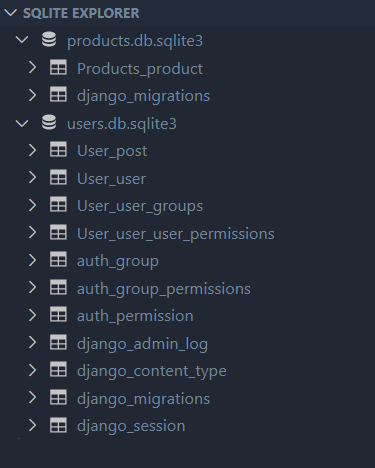

## Tradexa Assignment

An application that has two apps.

1. User with `user` and `Post` model User : first_name, last_name, email, password, username Post : user, text, created_at, updated_at Foreign key relationship exists between User and Post on Model level not on Database level.

2. Products app with `Product` model. Product : name, weight, price, created_at, updated_at Both of the apps should use two different databases. Create a form that an authenticated user can use to create a post.

Since specifications of fields have not been mentioned, I assumed all the fields are mandatory and not blank.

### Two seperate databases for two different apps:

- `users_db` for User app
- `products_db` for Products app

Look at the following screenshot of database schema



## Local project setup

### Have a local copy

Clone or download [Tradexa](https://github.com/vishnu-sagubandi/Tradex-Assignment) repository.

```sh
git clone https://github.com/vishnu-sagubandi/Tradex-Assignment.git
```

### Setting up Environment for Project

#### Basic Requirements

1. [Python](https://www.python.org/downloads/)
2. [pip](https://pip.pypa.io/en/stable/installation/)
3. [Django](https://www.djangoproject.com/download/)

#### Creating [Virtual Environment](https://docs.python.org/3/library/venv.html)

A virtual environment is a tool that helps keep dependencies required and the project isolated. If you wish to install a new library and write

```
pip install name_of_library
```

on the terminal without activating an environment, all the packages will be installed globally which is not a good practice if you’re working with different projects on your computer.

If this sounds a bit complicated, don’t worry so much because a virtual environment is just a directory that will contain all the necessary files for our project to run.

**Installing venv (required once)**

**Windows**

```
python -m pip install --user virtualenv
python -m venv env
```

**Linux**

```
python3 -m pip install --user virtualenv
python3 -m venv env
```

You have to start virtual environment everytime you start new terminal -

**Windows**

Using gitbash

```
. env/Scripts/activate
```

Using Powershell

```
. env\Scripts\activate
```

**Linux**

```
source env/bin/activate
```

#### Installing Requirements

**Windows**

```
pip install -r requirements.txt
```

**Linux**

```
pip3 install -r requirements.txt
```

#### Setting up Database

- Run `makemigrations` command.

  **Windows**

  ```
  python manage.py makemigrations
  ```

  **Linux**

  ```
  python3 manage.py makemigrations
  ```

- Migrate both databases.

  **Windows**

  ```
  python manage.py migrate --database=users_db
  python manage.py migrate --database=products_db
  ```

  **Linux**

  ```
  python3 manage.py migrate --database=users_db
  python3 manage.py migrate --database=products_db
  ```

- Create superuser.

  **Windows**

  ```
  python manage.py createsuperuser --database=users_db
  ```

  **Linux**

  ```
  python3 manage.py createsuperuser --database=users_db
  ```

- Start development server

  **Windows**

  ```
  python manage.py runserver
  ```

  **Linux**

  ```
  python3 manage.py runserver
  ```

#

<div align="center">
<h1>Thank You ❤️</h1>
<i>Other places you can find me:</i><br>

[](https://www.instagram.com/vishnu_107/)
[](https://twitter.com/Vishnu80305467)
[](https://www.facebook.com/vishnu.sagubandi/)
[](https://www.linkedin.com/in/vishnu-murthy-sagubandi-72022a191/)

</div>
